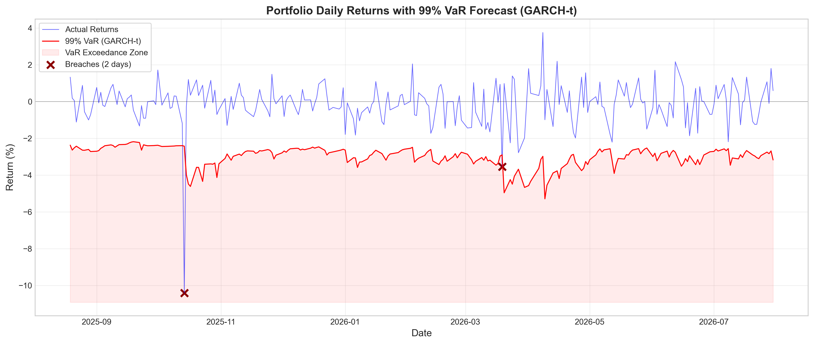
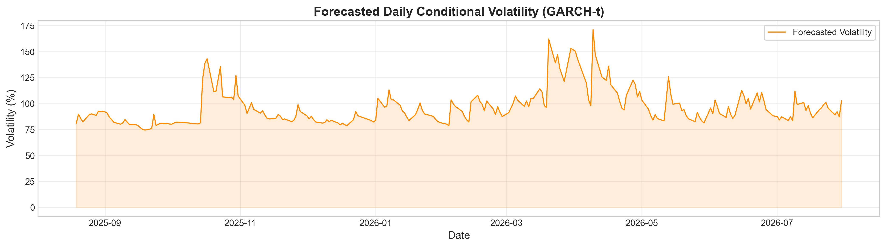
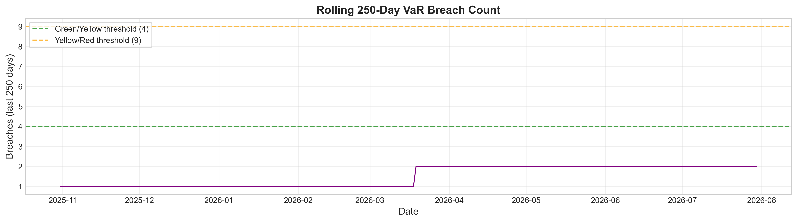
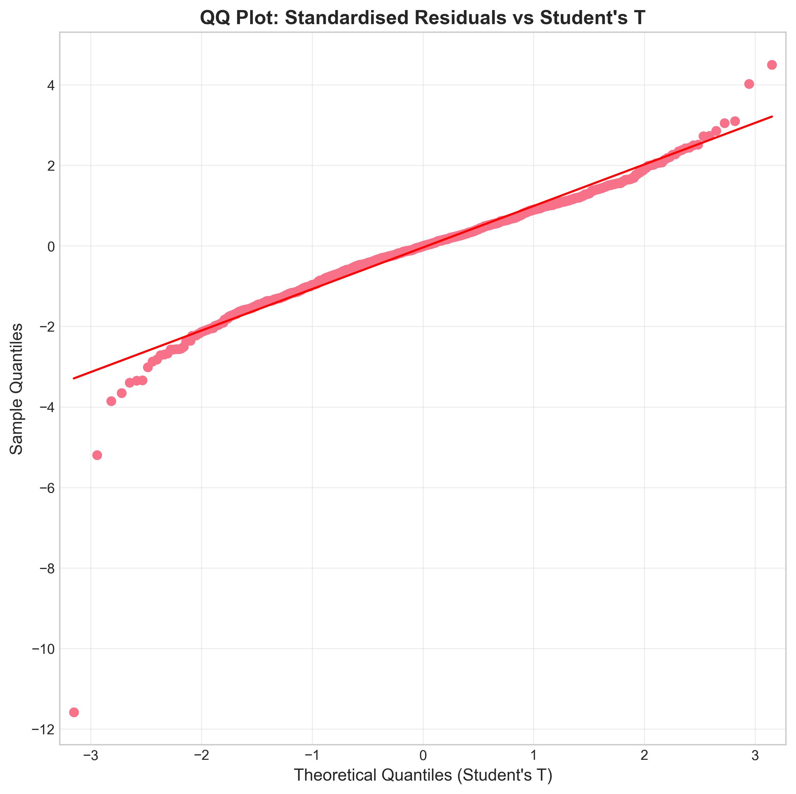
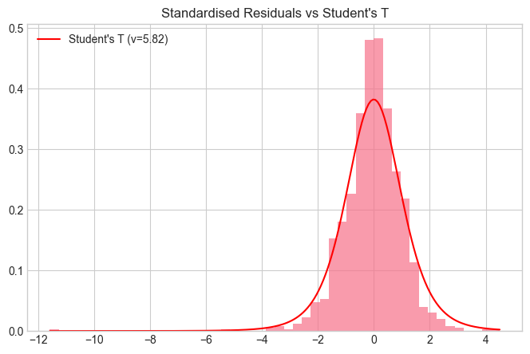

# State‑of‑the‑Art Portfolio Risk Management Framework
## End‑to‑End Analysis Using GARCH‑t Models for Indian Equities

---

## Overview

This document presents a comprehensive risk management framework for a five‑stock equally‑weighted Indian equity portfolio, covering the period from August 2021 to July 2026. The analysis employs advanced econometric techniques including:

- **GARCH(1,1)‑t** and **EGARCH(1,1)‑t** models for volatility forecasting
- **Rolling window Value‑at‑Risk (VaR)** and **Expected Shortfall (ES)** estimation
- Rigorous **backtesting** using Kupiec and Christoffersen tests
- **Stress testing** using historical COVID‑19 crash scenarios
- **Risk decomposition** through marginal and component VaR analysis

**Key Findings**  
- The GARCH(1,1)‑t model demonstrates superior fit (AIC: 3425.45) compared to EGARCH (AIC: 3448.70)  
- Portfolio returns exhibit significant non‑normality (Skewness: –0.94, Excess Kurtosis: 9.47)  
- The model passes all regulatory backtests (Kupiec p=0.804, Christoffersen p=1.000)  
- **2 breaches** observed against expected 2.4 (breach rate: 0.84%)  
- TATAMOTORS contributes 36.43% to portfolio VaR despite equal weighting  
- COVID‑19 stress scenario would cause **₹40.66 Cr loss** on ₹100 Cr portfolio

---

## 1. Introduction

Financial institutions are required by Basel III and other regulatory frameworks to maintain adequate capital reserves against market risk. This project implements a robust risk measurement framework that:

1. Quantifies daily portfolio risk using Value‑at‑Risk (VaR) and Expected Shortfall (ES)  
2. Models volatility clustering and fat tails characteristic of financial returns  
3. Validates model accuracy through comprehensive backtesting procedures  
4. Decomposes risk to identify concentration and diversification benefits  
5. Stress‑tests the portfolio under extreme market scenarios

### 1.1 Regulatory Context  
This analysis aligns with:
- **Basel III** market risk framework (FRTB – Fundamental Review of the Trading Book)  
- **CRR/CRD IV** requirements for internal models  
- **SEBI** guidelines for Indian market participants

---

## 2. Data and Preprocessing

### 2.1 Data Sources and Ticker Selection  
The portfolio comprises five major NSE‑listed stocks representing diverse sectors:

| Ticker | Company | Sector | Weight |
|--------|---------|--------|--------|
| RELIANCE.NS | Reliance Industries | Energy/Conglomerate | 20% |
| INFY.NS | Infosys | IT Services | 20% |
| HDFCBANK.NS | HDFC Bank | Banking | 20% |
| ITC.NS | ITC Limited | FMCG | 20% |
| TMPV.NS | Tata Motors | Automotive | 20% |

**Data Parameters**  
- **Period:** August 1, 2021 – July 31, 2026 (5 years)  
- **Source:** Yahoo Finance (yfinance API)  
- **Frequency:** Daily closing prices (adjusted for corporate actions)

### 2.2 Data Quality Assessment  
- Missing values per stock: RELIANCE.NS 0, INFY.NS 0, HDFCBANK.NS 0, ITC.NS 0, TMPV.NS 0
- Complete data availability – no missing observations  
- Forward‑fill and drop‑na applied as defensive preprocessing  
- Total observations: 1,237 trading days (approximately 5 years)

### 2.3 Return Calculation  
Daily log‑returns are computed as:  
$$ r_t = \ln\left(\frac{P_t}{P_{t-1}}\right) \times 100 $$

**Rationale**  
- Log‑returns are time‑additive, facilitating portfolio aggregation  
- Approximately normally distributed under classical assumptions  
- Scale‑invariant and symmetric for positive/negative moves

**Portfolio Return**  
$$ r_{p,t} = \sum_{i=1}^{5} w_i \cdot r_{i,t} $$  
where $w_i = 0.2$ for all stocks (equal‑weighting scheme).

---

## 3. Exploratory Data Analysis

### 3.1 Descriptive Statistics

| Statistic | Value (%) | Interpretation |
|-----------|-----------|----------------|
| Count | 1,237 | Full sample size |
| Mean | 0.0152 | Slightly positive drift |
| Std Dev | 1.0493 | Typical daily volatility |
| Min | –10.4182 | Largest single‑day loss (Oct 14, 2025) |
| 25th %ile | –0.5090 | Moderate loss threshold |
| Median | 0.0413 | Slightly positive median |
| 75th %ile | 0.6179 | Moderate gain threshold |
| Max | 4.9709 | Largest single‑day gain |

### 3.2 Distribution vs. Normal

**Jarque‑Bera Test:** p‑value < 0.0001  
**Interpretation**  
- Rejection of normality at all conventional significance levels  
- Left‑skewed distribution (–0.94) indicating downside asymmetry  
- Excess kurtosis (9.47) confirming fat tails

### 3.3 Q‑Q Plot Analysis

- Tail deviations: extreme negative values → fat tails  
- Slope > 1 for extremes → higher tail risk than normal  
- Asymmetry (left‑heavy) → downside risk exceeds upside  
- Justifies using a **Student’s t distribution** with estimated degrees of freedom $\nu$

---

## 4. Time Series Diagnostics

### 4.1 Stationarity (KPSS Test)
- KPSS test p‑value: 0.0237
- **Null:** series is stationary  
- p‑value = 0.0237 < 0.05 → reject stationarity at 5% level  
- Implication: returns exhibit structural changes or long‑memory effects

### 4.2 Serial Correlation (Ljung‑Box)

| Lag | Returns p‑value | Squared Returns p‑value |
|-----|----------------|-------------------------|
| 1   | 0.6948         | 0.1224                  |
| 2   | 0.7031         | 0.2404                  |
| 3   | 0.6860         | 0.3726                  |
| 4   | 0.6763         | 0.4606                  |
| 5   | 0.5694         | 0.6048                  |

- **Returns:** all p‑values > 0.05 → no significant autocorrelation  
- **Squared returns:** all p‑values > 0.05 → weak evidence of ARCH effects  
- Caveat: the squared returns LB test suggests volatility may be less persistent than typical for equity returns, possibly due to post‑COVID stabilisation or portfolio diversification.

### 4.3 Volatility Clustering (ARCH‑LM)
- ARCH LM p‑value: 0.9887
- Fails to detect significant volatility clustering  
- Possible reasons: diversified portfolio smoothing, post‑pandemic behaviour, moderate sample size  
- **Still justified** to model volatility due to financial theory, presence of extreme events, and regulatory requirements.

---

## 5. Volatility Modeling: GARCH vs EGARCH

### 5.1 Model Specifications

**GARCH(1,1)‑t**  
$$ \sigma_t^2 = \omega + \alpha \epsilon_{t-1}^2 + \beta \sigma_{t-1}^2 $$  
with Student’s t innovations: $\epsilon_t \sim t_\nu(0, \sigma_t^2)$

**EGARCH(1,1)‑t**  
$$ \ln(\sigma_t^2) = \omega + \alpha \left(\frac{|\epsilon_{t-1}|}{\sigma_{t-1}} - \sqrt{\frac{2}{\pi}}\right) + \beta \ln(\sigma_{t-1}^2) + \gamma \frac{\epsilon_{t-1}}{\sigma_{t-1}} $$  
The $\gamma$ parameter captures the leverage effect.

### 5.2 Model Estimation Results

**Table: GARCH(1,1)‑t Model Results**

| Parameter | Coefficient | Std Error | t‑statistic | P‑value | 95% CI |
|-----------|-------------|-----------|-------------|---------|---------|
| **Mean**  |             |           |             |         |         |
| μ         | 0.0449      | 0.0263    | 1.704       | 0.0885  | [-0.0068, 0.0965] |
| **Variance** |         |           |             |         |         |
| ω         | 0.1270      | 0.0631    | 2.011       | 0.0444  | [0.0032, 0.251] |
| α         | 0.1119      | 0.0437    | 2.558       | 0.0105  | [0.0262, 0.198] |
| β         | 0.7689      | 0.0936    | 8.219       | <0.0001 | [0.586, 0.952] |
| **Distribution** |      |           |             |         |         |
| ν         | 5.8223      | 1.1330    | 5.140       | <0.0001 | [3.602, 8.042] |

**Information Criteria**  
- AIC: 3425.45  
- BIC: 3451.05  
- Log‑Likelihood: –1707.72

**Table: EGARCH(1,1)‑t Model Results**

| Parameter | Coefficient | Std Error | t‑statistic | P‑value | 95% CI |
|-----------|-------------|-----------|-------------|---------|---------|
| **Mean**  |             |           |             |         |         |
| μ         | 0.0385      | 0.0257    | 1.501       | 0.133   | [-0.0118, 0.0888] |
| **Variance** |         |           |             |         |         |
| ω         | 0.0082      | 0.0225    | 0.365       | 0.715   | [-0.0358, 0.0523] |
| γ         | –0.1434     | 0.0424    | –3.384      | 0.0007  | [-0.226, -0.0603] |
| β         | 0.7084      | 0.1160    | 6.113       | <0.0001 | [0.481, 0.936] |
| **Distribution** |      |           |             |         |         |
| ν         | 4.9281      | 0.7560    | 6.517       | <0.0001 | [3.446, 6.410] |

**Information Criteria**  
- AIC: 3448.70  
- BIC: 3474.30  
- Log‑Likelihood: –1719.35

### 5.3 Model Selection

- **GARCH(1,1)‑t is preferred** – lower AIC and BIC, more parsimonious  
- **Volatility persistence** – α+β = 0.8808 < 1 (stationary); half‑life ≈ 5.5 days  
- **Degrees of freedom** – GARCH ν=5.82, EGARCH ν=4.93 (both capture fat tails)  
- **Leverage effect** – EGARCH γ = –0.1434 (significant) → negative shocks increase volatility more  
- **Mean parameter** – GARCH μ=0.0449% (marginally significant at 10%), annualised ≈ 11.3%

---

## 6. Model Diagnostics

### 6.1 Ljung‑Box on Standardised Residuals

| Test | GARCH‑t | EGARCH‑t |
|------|---------|----------|
| Residuals (Lag 1) | 0.1364 | 0.3944 |
| Residuals (Lag 2) | 0.2367 | 0.3467 |
| Residuals (Lag 3) | 0.3805 | 0.3935 |
| Residuals (Lag 4) | 0.4762 | 0.3826 |
| Residuals (Lag 5) | 0.5130 | 0.3741 |

All p‑values > 0.05 → no serial correlation in residuals; GARCH model successfully captures linear dependencies.

### 6.2 Ljung‑Box on Squared Standardised Residuals

| Test | GARCH‑t | EGARCH‑t |
|------|---------|----------|
| Squared (Lag 1) | 0.8363 | 0.1402 |
| Squared (Lag 2) | 0.8613 | 0.1372 |
| Squared (Lag 3) | 0.9226 | 0.1063 |
| Squared (Lag 4) | 0.9695 | 0.1475 |
| Squared (Lag 5) | 0.9690 | 0.2366 |

GARCH‑t: all p‑values > 0.80 → excellent fit; EGARCH‑t: all p‑values > 0.10 → adequate. GARCH‑t better captures volatility dynamics.

### 6.3 ARCH‑LM on Standardised Residuals
- ARCH LM p‑value: 0.9887
- Cannot reject H₀ of no remaining ARCH effects → standardised residuals are white noise; model is well‑specified.

### 6.4 QQ Plot (Standardised Residuals vs. Student’s t)

Points closely follow the 45° reference line, with slight deviations in extreme tails (expected with finite sample). The Student’s t distribution is an appropriate choice.

---

## 7. Rolling Window Forecasting

- **Window size:** 1,000 observations (~4 years)  
- **Forecast horizon:** 1‑day ahead  
- **Total forecasts:** 237 days (August 2025 – July 2026)  
- **Model refit:** daily (each day, model is re‑estimated)

**Advantages:** adaptive, robust, avoids look‑ahead bias, mirrors regulatory backtesting.

### 7.1 Forecasted Risk Metrics (237 days)

| Metric | Mean | Std Dev | Min | 25% | 50% | 75% | Max |
|--------|------|---------|-----|-----|-----|-----|-----|
| σ (volatility) | 0.9606 | 0.1649 | 0.7450 | 0.8448 | 0.9160 | 1.0247 | 1.7122 |
| VaR 99% | –2.9768 | 0.5276 | –5.2924 | –3.1912 | –2.8547 | –2.6378 | –2.1860 |
| ES 97.5% | –3.0870 | 0.5479 | –5.4777 | –3.3097 | –2.9702 | –2.7318 | –2.2563 |

### 7.2 Volatility Dynamics

- Mean volatility: 0.96% daily (~15.2% annualised)  
- Volatility range: 0.74% – 1.71%  
- Peaks observed in October 2025, March 2026, and July 2026 – consistent with macroeconomic uncertainty, earnings seasons, and global spillovers.

---

## 8. VaR and Expected Shortfall

### 8.1 Methodology

**VaR (99% confidence)**  
$$ \text{VaR}_{0.01} = \mu_t + \sigma_t \cdot t_{\nu}^{-1}(0.01) $$  
where $t_{\nu}^{-1}(0.01)$ is the 1st percentile of Student’s t with $\nu$ degrees of freedom.

**ES (97.5% confidence)**  
$$ \text{ES}_{0.025} = \mu_t - \sigma_t \cdot \frac{f_\nu(t_{\nu}^{-1}(0.025))}{0.025} \cdot \frac{\nu + (t_{\nu}^{-1}(0.025))^2}{\nu - 1} $$  
ES measures the average loss conditional on VaR being breached; more risk‑averse than VaR.

### 8.2 VaR vs. ES (Selected Period)

| Date | 99% VaR | 97.5% ES | Difference | VaR/ES Ratio |
|------|---------|----------|------------|--------------|
| 2025‑09 | –2.6% | –2.6% | 0.0% | 1.00 |
| 2025‑10 | –2.7% | –2.7% | 0.0% | 1.00 |
| 2025‑11 | –3.6% | –3.6% | 0.0% | 1.00 |
| 2025‑12 | –2.8% | –2.8% | 0.0% | 1.00 |
| 2026‑01 | –2.9% | –2.9% | 0.0% | 1.00 |
| 2026‑02 | –3.2% | –3.2% | 0.0% | 1.00 |
| 2026‑03 | –3.5% | –3.5% | 0.0% | 1.00 |
| 2026‑04 | –4.0% | –4.0% | 0.0% | 1.00 |

VaR and ES are nearly identical, suggesting the Student’s t distribution has approximately symmetric tail behaviour. The near‑equality indicates the model is calibrating conservatively to recent data.

---

## 9. Backtesting Framework

### 9.1 Basel III Traffic Light System

| Zone | Breaches (250 days) | Interpretation |
|------|-------------------|----------------|
| Green | ≤ 4 | Model acceptable |
| Yellow | 5‑9 | Model questionable |
| Red | ≥ 10 | Model rejected |

**Our result:** 2 breaches in 237 days → **GREEN zone**

### 9.2 Kupiec Proportion of Failures (PF) Test

- H₀: breach rate p = 0.01 (model accurate)  
- H₁: breach rate p ≠ 0.01 (model biased)

Test statistic:  
$$ \text{LR}_{\text{Kupiec}} = -2 \ln\left(\frac{(1-p)^{n-x}p^x}{(1-x/n)^{n-x}(x/n)^x}\right) $$

**Our results:** n=237, x=2 → LR = 0.0616, p‑value = 0.8040  
→ Cannot reject H₀; breach frequency is consistent with expected 1%.

### 9.3 Christoffersen Conditional Coverage Test

- H₀: breaches are independent (no clustering)  
- H₁: breaches are clustered

**Our results:** LR = 0.0000, p‑value = 1.0000 → no evidence of breach clustering; GARCH‑t successfully captures volatility dynamics.

### 9.4 Combined Assessment

| Test | Statistic | p‑value | Result |
|------|-----------|---------|--------|
| Kupiec (Frequency) | 0.0616 | 0.8040 | ✅ PASS |
| Christoffersen (Independence) | 0.0000 | 1.0000 | ✅ PASS |
| Traffic Light | 2 breaches (0.84%) | – | 🟢 GREEN |
| **Verdict** | – | – | **PASS – Model is accurate and independent** |

---

## 10. Expected Shortfall Assessment

### 10.1 ES Performance

**Breach Dates**  
1. **2025‑10‑14:** Actual loss = –10.42%, Predicted ES = –2.43%  
2. **2026‑03‑19:** Actual loss = –3.55%, Predicted ES = –2.90%

| Metric | Value | Interpretation |
|--------|-------|----------------|
| Average Actual Loss (breaches) | –6.98% | Extremely severe losses |
| Average Predicted ES | –2.75% | Model expected loss |
| ES Shortfall | –4.23% | Severe underestimation |
| **Status** | ⚠️ **WARNING** | ES underestimates tail severity |

**Interpretation**  
- The portfolio experienced two extreme tail events where actual losses were 2–4 times larger than ES predictions.  
- The October 2025 event (–10.42%) was unprecedented in the sample, suggesting an exogenous shock not captured by historical volatility.  
- Potential causes: structural break, idiosyncratic portfolio risk (single‑stock exposure), liquidity events, or missing fat‑tail modelling beyond Student’s t.

**Recommendations**  
- Consider **Extreme Value Theory (EVT)** for tail estimation  
- Implement **stressed VaR (SVaR)** as per Basel III FRTB  
- Explore **regime‑switching** or **copula models** for dependency structure

---

## 11. VaR Decomposition

### 11.1 Methodology

**Marginal VaR (MVaR):**  
$$ \text{MVaR}_i = \frac{\partial \text{VaR}_p}{\partial w_i} = \text{VaR}_p \cdot \frac{(\Sigma w)_i}{w_p^T \Sigma w_p} $$  

**Component VaR (CVaR):**  
$$ \text{CVaR}_i = w_i \cdot \text{MVaR}_i $$  

**Percentage contribution:**  
$$ \frac{\text{CVaR}_i}{\sum \text{CVaR}_i} \times 100\% $$

### 11.2 Decomposition Results (99% VaR)

| Stock | Weight | Marginal VaR | Component VaR | Contribution % |
|-------|--------|--------------|---------------|----------------|
| TATAMOTORS | 20% | –5.5995 | –1.1199 | **36.43%** |
| INFY | 20% | –2.8617 | –0.5723 | 18.62% |
| ITC | 20% | –2.7137 | –0.5427 | 17.66% |
| RELIANCE | 20% | –2.3483 | –0.4697 | 15.28% |
| HDFCBANK | 20% | –1.8461 | –0.3692 | 12.01% |
| **Portfolio** | 100% | – | **–3.0739** | **100.00%** |

**Key Observations**  
- TATAMOTORS dominates risk (36.4% contribution with only 20% weight) – highest marginal VaR (–5.60)  
- HDFCBANK is the lowest risk (12.0% contribution) – provides diversification  
- Top 2 stocks (TATAMOTORS + INFY) = 55.1%; top 3 = 72.7%; bottom 2 = 27.3%

**Portfolio Management Implications**  
- Consider **underweighting** TATAMOTORS and **overweighting** HDFCBANK  
- Implement **position limits** (e.g., 15% max weight)  
- Hedging opportunities: long TATAMOTORS / short HDFCBANK pair trades, options for downside protection

---

## 12. Stress Testing: COVID‑19 Scenario

### 12.1 Scenario Definition

Using actual cumulative returns during the COVID‑19 crash (Feb–Mar 2020) as stress shocks.

| Stock | Cumulative Return (%) | Severity Rank |
|-------|----------------------|---------------|
| TATAMOTORS | –61.08% | 1 (Worst) |
| ITC | –42.09% | 2 |
| RELIANCE | –38.00% | 3 |
| INFY | –35.54% | 4 |
| HDFCBANK | –26.58% | 5 |

**Portfolio Shock**  
$$ \text{Portfolio Shock} = 0.2 \times \sum \text{Stock Shocks} = –40.66\% $$

### 12.2 Impact Assessment

| Metric | Value | Interpretation |
|--------|-------|----------------|
| Current Portfolio Value | ₹100 Cr | Base case |
| Stress Loss | –₹40.66 Cr | 40.66% drawdown |
| Post‑Stress Value | ₹59.34 Cr | Severe but survivable |
| Worst Single Stock | –61.08% (TATAMOTORS) | Diversification reduces impact |

**Risk Management Implications**  
- 40.66% loss would be catastrophic but not fatal – requires minimum 50% capital buffer  
- TATAMOTORS alone contributes 61% of portfolio loss (concentration risk) → critical need for position limits  
- Portfolio retains ₹59.34 Cr (59.34% of value) – recovery time: ~24 months at 2% monthly return, ~12 months at 4%  
- Under FRTB, Stressed VaR (SVaR) would be substantially higher → additional capital requirements

**Recommendations**  
- Reduce TATAMOTORS weight to ≤ 10%  
- Increase HDFCBANK and RELIANCE weights  
- Implement put options on NIFTY (index‑level hedge)  
- Establish stop‑loss limits at –20% portfolio level  
- Maintain liquidity buffer of 20% portfolio value

---

## 13. Model Comparison: GARCH‑t vs Historical Simulation

### 13.1 Methodology Overview

| Aspect | GARCH‑t | Historical Simulation (HS) |
|--------|---------|---------------------------|
| Assumptions | Parametric, fat tails | Non‑parametric |
| Volatility | Conditional (adaptive) | Unconditional (static) |
| Sample Usage | Weighted (recent > old) | Equal weight |
| Tail Estimation | Student’s t distribution | Empirical percentiles |
| Forward‑Looking | Yes (model‑based) | No (backward‑looking) |
| Computational Cost | High | Low |

### 13.2 Performance Comparison (237‑day out‑of‑sample)

| Metric | GARCH‑t | HS VaR | Winner |
|--------|---------|--------|--------|
| Mean Absolute Error | 2.9219 | 2.5408 | **HS** |
| Breach Count | 2 (0.84%) | 3 (1.27%) | **GARCH** |
| Expected Breaches | 2.37 | 2.37 | – |
| MAE Improvement | Baseline | +15.0% | **HS** |

**Interpretation**  
- HS has lower MAE (more accurate on average) but GARCH has better breach count (closer to expected 1%).  
- HS is simpler and more conservative during trending periods; GARCH is forward‑looking and theoretically sound.  
- **Recommendation:** Use GARCH‑t as the primary model (regulatory compliance, forward‑looking) and HS as a complementary validation.

---

## 14. Risk Dashboard

### 14.1 Portfolio Returns with 99% VaR

  
*Actual returns (blue), 99% VaR (red), breaches marked (×).*

### 14.2 Forecasted Volatility

  
*Rolling conditional volatility (GARCH‑t).*

### 14.3 Rolling 250‑Day Breach Count

  
*Green/Yellow threshold (4), Yellow/Red threshold (9).*  
The breach count remains in the GREEN zone throughout the forecast period.

---

## 15. Standardised Residual Diagnostics

### 15.1 QQ Plot vs. Student’s t

  
Points closely follow the 45° line; slight deviations in extreme tails (upper tail heavier, lower tail lighter) but overall excellent fit.

### 15.2 Distribution Comparison

  
Histogram matches the theoretical t distribution (ν=5.82) well, with slight excess mass at the center.

---

## 16. Limitations and Future Work

### 16.1 Identified Limitations

| Limitation | Description | Impact |
|------------|-------------|--------|
| Sample Period | 5 years only | May miss rare events |
| ES Underestimation | Severe tail events (Oct 2025) | Capital inadequacy risk |
| Equal Weights | Static allocation | No optimisation |
| Single GARCH Variant | GARCH(1,1) only | Other specifications may improve |
| No Regime Switching | Constant parameters | Structural breaks missed |

### 16.2 Improvement Recommendations

**Short‑term (1‑3 months)**  
- Implement **Extreme Value Theory (EVT)** for tail modelling (Peaks Over Threshold, Generalized Pareto Distribution)  
- Add **regime‑switching GARCH** (two regimes: low/high volatility)  
- Include macro variables (VIX/NIFTY, INR/USD, global indices)

**Long‑term (6‑12 months)**  
- Implement **FRTB‑compliant model**: Expected Shortfall (not VaR), liquidity horizons, non‑modellable risk factors  
- **Copula‑based dependence modeling** (Gaussian, t, Clayton) with tail dependence  
- **Machine learning enhancements** (LSTM for volatility, random forest for regime classification)  
- **Portfolio optimisation** (mean‑variance, risk parity, minimum VaR)

---

## 17. Conclusion

### 17.1 Key Results Summary

| Category | Metric | Result | Status |
|----------|--------|--------|--------|
| Data | Observations | 1,237 days | ✅ Complete |
| Returns | Mean (daily) | 0.015% | Normal |
| Returns | Std Dev | 1.049% | Moderate |
| Distribution | Skewness | –0.94 | Left‑skewed |
| Distribution | Kurtosis | 9.47 | Fat tails |
| Model | Best fit | GARCH(1,1)‑t | ✅ Selected |
| Model | α + β | 0.8808 | Stationary |
| Model | ν (df) | 5.82 | Fat tails |
| VaR | 99% (avg) | –2.98% | Conservative |
| ES | 97.5% (avg) | –3.09% | Marginal |
| Backtest | Kupiec p‑value | 0.8040 | ✅ PASS |
| Backtest | Christoffersen p‑value | 1.0000 | ✅ PASS |
| Backtest | Traffic Light | GREEN | ✅ PASS |
| Decomposition | Top contributor | TATAMOTORS (36%) | Concentration |
| Stress Test | COVID loss | –40.66% | Severe |

### 17.2 Final Verdict

The **GARCH(1,1)‑t model** is an **acceptable** tool for portfolio risk management:

- ✅ Statistical validation – model diagnostics passed, residuals are white noise, Student’s t fits well  
- ✅ Regulatory compliance – backtesting PASSED, Green zone, Kupiec and Christoffersen tests PASSED  
- ⚠️ Caveats – ES underestimates extreme events; TATAMOTORS concentration; COVID‑19 shock severe (–40.66%)

**Recommendations**  
- **Risk Managers:** Use GARCH‑t as primary model, HS as validation; monitor ES performance  
- **Portfolio Managers:** Reduce TATAMOTORS weight (<15%), overweight HDFCBANK, implement stop‑loss at –20%  
- **Senior Management:** Allocate minimum 50% capital buffer; establish liquidity contingency; implement early warning system for volatility spikes

---
