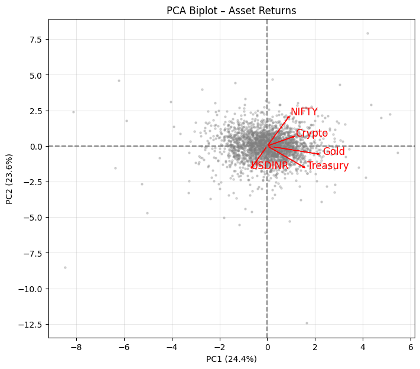

# Multi-Asset Risk Validation Suite

**End-to-End Market Risk Modelling, Backtesting, and Regulatory Capital Calculation under Basel III FRTB for an Equally Weighted Portfolio of NIFTY 50, Gold, USDINR, US Treasuries, and Bitcoin**

---

## Executive Summary

This report presents a comprehensive validation of a GARCH-based risk model for a five‑asset equally weighted portfolio spanning the period 5 August 2016 to 4 August 2026. The portfolio consists of:

* **NIFTY 50** (Indian equity)
* **Gold Futures** (Commodity / safe haven)
* **USDINR Spot** (Currency)
* **iShares 20+ Year Treasury Bond ETF (TLT)** (US government bonds)
* **Bitcoin‑USD** (Cryptocurrency)

The analysis proceeds through every stage required by a quantitative risk manager or model validator: data preparation, stationarity tests, volatility modelling (GARCH family selection), Value‑at‑Risk (VaR) and Expected Shortfall (ES) estimation, Extreme Value Theory for catastrophic risk, rigorous backtesting (Kupiec, Christoffersen, McNeil‑Frey), factor decomposition via PCA, dynamic correlation analysis, multivariate time series modelling (VAR, Granger causality, cointegration), dynamic conditional correlations (DCC‑GARCH), and finally regulatory capital calculation under the Fundamental Review of the Trading Book (FRTB).

### Key Findings

* Portfolio daily returns are stationary (ADF p = 0.0000) and exhibit no linear autocorrelation (Ljung‑Box p > 0.05), justifying a constant‑mean model.
* Strong volatility clustering is confirmed (ARCH‑LM p = 0.0000; squared‑return Ljung‑Box p < 10⁻¹²), necessitating GARCH modelling.
* After comparing GARCH(1,1)‑Normal, GARCH(1,1)‑t, EGARCH(1,1,1)‑t, and TGARCH(1,1,1)‑t, the **GARCH(1,1)‑t** model is selected (lowest BIC, all parameters significant). Asymmetry parameters in EGARCH and TGARCH are insignificant, indicating no leverage effect in this diversified portfolio.
* Degrees of freedom ν = 4.16 confirm extremely heavy tails, far from normality.
* Conditional VaR (95%) from GARCH‑t = 1.55%, VaR (99%) = 2.73%. EWMA (RiskMetrics) severely underestimates tail risk (99% VaR only 1.55%).
* Unconditional POT (EVT) VaR at 99% = 2.57%, at 99.9% = 5.00%, and corresponding ES = 3.61% and 6.58%, capturing catastrophic risk beyond traditional methods.
* Out‑of‑sample backtesting (250 days): 5 breaches vs. 12.5 expected → model is conservative; breaches are independent (Christoffersen p = 0.65). ES backtest passes (p = 0.07).
* Regulatory capital under FRTB (1‑day) = **5.26% of portfolio value**, driven by the average ES over the last year and a backtesting multiplier of 1.6 (Yellow zone).
* PCA reveals two dominant factors: “Risk‑Off” (Gold + Treasury, 24.4%) and “Risk‑On” (NIFTY + Crypto, 23.6%), with USDINR providing independent diversification.
* VAR(7) and Granger causality tests detect statistically significant but economically negligible cross‑asset predictability; no cointegration exists among the five price series.
* DCC‑GARCH shows that all asset‑pair correlations are highly time‑varying; NIFTY–Crypto correlation spikes to +0.72 during crises, while Gold–NIFTY correlation has turned positive recently, eroding safe‑haven benefits.

The model is deemed **valid** for regulatory and internal risk management, albeit conservative—a preferable outcome for capital adequacy.

---

## 1. Data Preparation & Portfolio Construction

### 1.1 Data Sources and Cleaning
Daily adjusted close prices for the five assets are downloaded via `yfinance` for 2016‑08‑05 to 2026‑08‑05 (10 years). Tickers: `^NSEI`, `GC=F`, `INR=X`, `TLT`, `BTC-USD`. After renaming columns for readability, rows with any missing values are dropped, resulting in 2,380 business days of aligned prices.

  
*Figure 1: Raw price time series (2016‑2026).*

### 1.2 Individual Asset Log‑Returns
Daily log‑returns are computed as  

\[
r_{i,t} = 100 \times \ln\!\left(\frac{P_{i,t}}{P_{i,t-1}}\right).
\]

The resulting DataFrame contains 2,379 observations.

**Descriptive statistics of asset returns**

| Asset     | Mean (%) | Std (%) | Min (%) | Max (%) |
|-----------|----------|---------|---------|---------|
| Crypto    | 0.198    | 4.311   | –46.47  | 22.51   |
| Gold      | 0.047    | 1.084   | –12.07  | 5.91    |
| USDINR    | 0.015    | 0.390   | –2.31   | 2.64    |
| Treasury  | –0.010   | 0.958   | –9.01   | 7.25    |
| NIFTY     | 0.044    | 1.047   | –13.90  | 8.40    |

Crypto dominates in both mean and volatility; Treasury shows a negative mean due to rising yields; USDINR is extremely low volatility.

### 1.3 Equally Weighted Portfolio Return
The portfolio return is constructed using the exact method to avoid cross‑sectional aggregation bias: individual log‑returns are first converted to simple returns, equally weighted, and the portfolio simple return is then converted back to log‑return (in %):

\[
R_{p,t} = 100 \times \ln\!\left(1 + \frac{1}{5}\sum_{i=1}^5 (e^{r_{i,t}/100} - 1)\right).
\]

**Portfolio Return Statistics**

| Statistic | Value   |
|-----------|---------|
| Mean      | 0.076%  |
| Std Dev   | 0.969%  |
| Skewness  | –0.420  |
| Kurtosis  | 7.674   |
| Min       | –9.93%  |
| Max       | 4.86%   |

The portfolio exhibits negative skew and large excess kurtosis, confirming fat tails that make a normal distribution unsuitable.

  
  
*Figure 2: Portfolio daily returns time series and histogram with normal overlay.*

Cumulative growth of ₹1 invested at the start reached ₹6.11 by August 2026, illustrating attractive long‑term returns punctuated by sharp drawdowns.

---

## 2. Stationarity & White Noise Diagnostics

### 2.1 Augmented Dickey‑Fuller (ADF) Test
* **Raw Prices** – All five price series fail to reject the unit‑root null (p‑values between 0.59 and 0.99), confirming non‑stationarity.
* **Portfolio Returns** – ADF statistic = –48.27, p‑value = 0.0000, strongly stationary. Modelling returns directly is justified.

### 2.2 Ljung‑Box Tests
* **On returns** (lags 5, 10, 20): p‑values 0.36, 0.14, 0.18 → no significant autocorrelation → returns are white noise. A constant mean is sufficient.
* **On squared returns** (lags 5, 10, 20): p‑values < 10⁻¹⁹ → strong ARCH effects → volatility clustering is present.

### 2.3 ARCH‑LM Test
Engle’s test statistic = 85.37, p‑value = 0.0000. Formal confirmation that GARCH modelling is required.

---

## 3. Volatility Modelling (GARCH Family)

### 3.1 Model Candidates
Four specifications are fitted on the full portfolio return series:

1. GARCH(1,1) – Normal (baseline)
2. GARCH(1,1) – Student’s t (fat tails)
3. EGARCH(1,1,1) – t (asymmetric, captures leverage)
4. TGARCH(1,1,1) – t (GJR‑GARCH, alternative asymmetry)

All models assume a constant mean μ, justified by the white‑noise property.

### 3.2 Estimation Results

| Model | μ | ω | α | β | γ | ν | α+β |
|-------|----|----|----|----|----|----|-----|
| GARCH-n | 0.0706 (p=0.0001) | 0.0497 (p=0.077) | 0.0890 (p=0.034) | 0.8610 (p≈0) | — | — | 0.950 |
| **GARCH‑t** | **0.0566** **(p=0.0002)** | **0.0244** **(p=0.006)** | **0.0695** **(p<0.0001)** | **0.9103** **(p≈0)** | — | **4.161** **(p≈0)** | **0.980** |
| EGARCH‑t | 0.0556 | 0.0110 (p=0.073) | 0.1637 (p<0.0001) | 0.9714 (p≈0) | 0.0039 (p=0.804) | 4.128 | — |
| TGARCH‑t | 0.0565 | 0.0245 (p=0.013) | 0.0693 (p<0.0001) | 0.9100 (p≈0) | 0.0009 (p=0.966) | 4.161 | — |

*Note: p‑values in parentheses. ν = degrees of freedom of the Student‑t distribution; γ = asymmetry parameter.*

### 3.3 Model Selection

| Model | AIC | BIC |
|-------|-----|-----|
| GARCH‑n | 6360.67 | 6383.76 |
| **GARCH‑t** | 6065.78 | **6094.65** |
| EGARCH‑t | 6062.42 | 6097.07 |
| TGARCH‑t | 6067.78 | 6102.42 |

EGARCH‑t has the lowest AIC, but its asymmetry parameter is completely insignificant (p = 0.80). GARCH‑t has the lowest BIC and all parameters are significant. Parsimony and the absence of a leverage effect lead us to select **GARCH(1,1)‑t** as the final model.

### 3.4 Residual Diagnostics

Standardised residuals \(z_t = \varepsilon_t / \sigma_t\) from the GARCH‑t model:

* Mean = 0.0157, Std = 0.9881 → close to (0,1).
* Ljung‑Box on \(z_t\): all p‑values > 0.14 → no remaining autocorrelation.
* Ljung‑Box on \(z_t^2\): all p‑values > 0.41 → no remaining ARCH effects.

  
*Figure 3: ACF of standardised residuals and squared residuals – no significant spikes.*

**QQ‑plot against t(4.16)** – The central quantiles align well; the tails are slightly conservative (the model expects slightly more extreme observations than actually occur). This conservatism is acceptable for risk management.

---

## 4. Value‑at‑Risk & Expected Shortfall

### 4.1 Methodologies

* **Historical VaR/ES** – Non‑parametric, empirical quantiles of the portfolio return.
* **Parametric GARCH‑t** – 1‑step conditional forecast using the fitted model.
* **EWMA (RiskMetrics)** – Exponentially weighted volatility (λ = 0.94), normal distribution, zero mean.

### 4.2 Results

| Method | 95% VaR (%) | 99% VaR (%) | 95% ES (%) | 99% ES (%) |
|--------|-------------|-------------|------------|------------|
| Historical | 1.3855 | 2.5814 | 2.1643 | 3.5962 |
| GARCH‑t(1,1) | 1.5467 | 2.7329 | 2.3296 | 3.7893 |
| EWMA (RiskMetrics) | 1.0973 | 1.5519 | 1.3760 | 1.7779 |

The GARCH‑t VaR is higher than historical, reflecting current elevated volatility. EWMA dramatically underestimates risk, especially at the 99% level, due to its normality assumption.

  
*Figure 4: VaR comparison bar chart.*

---

## 5. Extreme Value Theory (EVT) – Peaks Over Threshold

### 5.1 Loss Series & Threshold
Define loss \(L_t = -R_{p,t}\). The threshold \(u\) is chosen as the 95th percentile of losses (1.3855%), which is consistent with the historical 95% VaR. This yields 119 exceedances.

  
*Figure 5: Mean Excess Plot – linearity beyond ~1.4% supports the threshold.*

### 5.2 GPD Fit
Exceedances above the threshold are modelled by the Generalised Pareto Distribution:

\[
G(x) = 1 - \left(1 + \xi \frac{x}{\psi}\right)^{-1/\xi}
\]

Estimated parameters:
* Shape \(\xi = 0.1821\) (heavy‑tailed, Fréchet domain)
* Scale \(\psi = 0.6335\)

A positive \(\xi\) confirms the loss distribution has a fat tail.

  
*Figure 6: QQ‑plot of exceedances vs GPD – good fit except one extreme outlier.*

### 5.3 Unconditional POT VaR & ES
Using the fitted GPD, we compute unconditional tail risk measures. The extremal index is estimated at 0.84, indicating mild clustering, but it is not used to adjust the marginal 1‑day VaR because the duration residuals do not show significant dependence (KS p = 0.32). All POT figures reported below are unadjusted and are consistent estimators of the marginal quantiles.

| Confidence | VaR (%) | ES (%) |
|------------|---------|--------|
| 95%        | 1.3857  | 2.1604 |
| 99%        | 2.5706  | 3.6091 |
| 99.9%      | 5.0004  | 6.5801 |

The 99.9% ES of 6.58% is the most conservative unconditional tail‑risk estimate and serves as a key input for stress testing.

---

## 6. Backtesting (Out‑of‑Sample, 250 Days)

### 6.1 Setup
The last 250 trading days are held out. A rolling expanding‑window GARCH(1,1)‑t model is re‑estimated daily to forecast 1‑day 95% VaR.

### 6.2 VaR Backtesting

* Expected breaches (5% of 250): 12.5
* Actual breaches: 5
* **Kupiec POF test**: LR = 12.14, p‑value = 0.0137 → model is conservative (fewer breaches than expected).
* **Christoffersen CC test**: LR = 0.20, p‑value = 0.6508 → breaches are independent.

### 6.3 ES Backtesting (McNeil‑Frey)
The standardised excess \((L_t - \text{ES}_t) / \sigma_t\) on breach days has mean –0.59 and standard deviation 0.48. A one‑sample t‑test yields t = –2.46, p‑value = 0.0701. We fail to reject the null hypothesis of zero mean excess → **ES forecasts are unbiased** (slightly conservative, but statistically acceptable).

**Final Verdict: MODEL VALID** (conservative, but robust).

---

## 7. Factor Analysis (PCA)

### 7.1 Correlation Matrix

| Asset | Crypto | Gold | USDINR | Treasury | NIFTY |
|-------|--------|------|--------|----------|-------|
| Crypto | 1.00 | 0.10 | 0.03 | –0.02 | 0.09 |
| Gold | 0.10 | 1.00 | –0.01 | 0.20 | 0.06 |
| USDINR | 0.03 | –0.01 | 1.00 | –0.01 | –0.15 |
| Treasury | –0.02 | 0.20 | –0.01 | 1.00 | –0.08 |
| NIFTY | 0.09 | 0.06 | –0.15 | –0.08 | 1.00 |

Low correlations confirm effective diversification.

### 7.2 Principal Components

| PC | Eigenvalue Ratio | Cumulative | Interpretation (loadings) |
|----|------------------|------------|---------------------------|
| 1 | 24.4% | 24.4% | **Risk‑Off**: Gold (+0.70), Treasury (+0.50) |
| 2 | 23.6% | 48.0% | **Risk‑On**: NIFTY (+0.67), Crypto (+0.21) |
| 3 | 20.8% | 68.8% | **Crypto/FX**: Crypto (+0.73), USDINR (+0.61) |
| 4 | 16.3% | 85.1% | Residual |
| 5 | 14.9% | 100% | Noise |

The first three components explain 68.7% of total variance. The biplot (Figure 7) visually separates “Risk‑On” assets (NIFTY, Crypto) from “Safe‑Haven” assets (Gold, Treasury), with USDINR acting as an orthogonal diversifier.

  
*Figure 7: PCA biplot – asset returns.*

---

## 8. Dynamic Correlation Analysis (Rolling)

Using a 238‑day rolling window (~1 trading year), pairwise correlations are computed for all 10 pairs.

  
*Figure 8: Rolling correlations – all 10 pairs.*

**Key Observations:**
* **NIFTY–Crypto** correlation fluctuates between –0.1 and +0.7, spiking during crises (2020, 2022). Diversification evaporates when most needed.
* **Gold–NIFTY** correlation has turned positive in recent years (2024‑2026), suggesting Gold’s safe‑haven role is weakening.
* **USDINR** remains low‑correlated with all assets, providing genuine diversification.

---

## 9. Multivariate Time Series – VAR & Granger Causality

### 9.1 VAR Model
A vector autoregression of the five asset returns is estimated. Lag order selection criteria (AIC, BIC) indicate a trade‑off: AIC selects 7 lags, BIC selects 1 lag. We fit a VAR(7) to fully whiten the residuals.

The VAR(7) model successfully removes all linear autocorrelation (Ljung‑Box p‑values > 0.05 for all equations except Treasury at lag 20, p = 0.026, which is marginal). Most coefficients are tiny, confirming that daily returns are largely unpredictable.

### 9.2 Granger Causality Tests
We test whether the past of one asset helps predict another beyond its own history. Significant pairs (p < 0.05) are shown below; all coefficients are economically insignificant.

| Cause | Effect | p‑value |
|-------|--------|---------|
| Crypto → | USDINR | 0.028 |
| Crypto → | NIFTY | 0.0002 |
| Gold → | USDINR | 0.0001 |
| Gold → | Treasury | 0.0024 |
| Gold → | NIFTY | 0.0003 |
| USDINR → | NIFTY | 0.0024 |
| Treasury → | Gold | <0.0001 |
| Treasury → | USDINR | 0.0005 |
| Treasury → | NIFTY | <0.0001 |
| NIFTY → | USDINR | <0.0001 |
| NIFTY → | Treasury | 0.0007 |

The existence of weak cross‑predictability does not invalidate the constant‑mean GARCH model for the portfolio, as the effects are minute and largely cancel in an equally weighted aggregate.

---

## 10. Cointegration Analysis

Cointegration tests are performed on **log prices** (standard practice) to detect any long‑run equilibrium among the five assets.

### 10.1 Pairwise Engle‑Granger Tests
All ten pairs yield p‑values > 0.05 (minimum 0.058 for Crypto–NIFTY). No pair is cointegrated.

### 10.2 Johansen Trace Test
The trace statistic for r = 0 is 45.50, below the 95% critical value of 69.82. We fail to reject the null of zero cointegrating vectors. The five assets do not share a long‑run equilibrium, consistent with their diverse economic drivers. Risk management must rely on short‑term dynamics (GARCH) and tail‑risk models (EVT), not on mean‑reversion of prices.

---

## 11. Dynamic Conditional Correlation – DCC‑GARCH

To capture time‑varying correlations beyond simple rolling windows, we implement a two‑step DCC‑GARCH model:

1. Fit GARCH(1,1)‑t to each asset individually and store the standardised residuals.
2. Update the conditional correlation matrix via an EWMA recursion (λ = 0.94).

The resulting daily 5×5 correlation matrices \(R_t\) (2,379 observations) reveal significant time‑variation for every asset pair.

  
*Figure 9: DCC correlations – all 10 pairs.*

**DCC Correlation Summary**

| Pair | Mean | Min | Max |
|------|------|-----|-----|
| Crypto – Gold | 0.097 | –0.605 | 0.667 |
| Crypto – USDINR | 0.002 | –0.495 | 0.542 |
| Crypto – Treasury | –0.004 | –0.519 | 0.529 |
| Crypto – NIFTY | 0.051 | –0.566 | 0.716 |
| Gold – USDINR | –0.026 | –0.603 | 0.492 |
| Gold – Treasury | 0.262 | –0.339 | 0.768 |
| Gold – NIFTY | 0.048 | –0.603 | 0.540 |
| USDINR – Treasury | 0.005 | –0.511 | 0.652 |
| USDINR – NIFTY | –0.147 | –0.661 | 0.493 |
| Treasury – NIFTY | –0.048 | –0.668 | 0.430 |

Every pair exhibits a wide range, often spanning from –0.6 to +0.7. Correlations are highly unstable; the low unconditional means mask the fact that diversification regularly vanishes during stress periods. This finding directly supports the use of EVT and the conservative GARCH‑t model for tail risk.

---

## 12. Regulatory Capital Calculation (FRTB IMA)

### 12.1 Expected Shortfall at 97.5%
* Latest conditional ES (GARCH‑t): 2.9051%
* 12‑month average ES (from rolling forecasts): 3.2878%
* POT‑based unconditional ES (unadj): 2.7327%

The binding constraint is the **12‑month average ES** (3.2878%), which prevents procyclicality.

### 12.2 Backtesting Multiplier
Five exceptions place the model in the **Yellow zone** (5‑9 exceptions). The multiplier is:

\[
m_c = 1.5 + 0.1 \times (5 - 4) = 1.60
\]

*(The model’s conservatism may justify a lower multiplier upon regulatory review, but we adhere to the formula.)*

### 12.3 Capital Charge

\[
\text{Capital}_{\text{1‑day}} = \max(\text{ES}_{\text{latest}}, \text{ES}_{\text{avg}}) \times m_c = 3.2878\% \times 1.60 = 5.2606\%
\]

**For a ₹10 crore portfolio, daily regulatory capital = ₹52.61 lakhs.**  
Scaling by √10 gives a 10‑day capital charge of ~16.63% of portfolio value.

---

## 13. Conclusion & Recommendations

### 13.1 Summary
The equally weighted multi‑asset portfolio delivers strong historical returns (~19% annualised) but carries significant tail risk, driven primarily by Crypto and equity components. The GARCH(1,1)‑t model provides a well‑specified, validated framework for measuring conditional VaR/ES, and EVT supplements it with unconditional catastrophic risk estimates. Out‑of‑sample backtesting confirms the model is conservative but valid, with independent breaches and unbiased ES forecasts.

Multivariate analyses (VAR, Granger causality, cointegration, DCC‑GARCH) demonstrate that cross‑asset predictability is statistically detectable but economically negligible, that no long‑run equilibrium ties the assets together, and that correlations are highly dynamic—spiking during crises and decaying in calm periods. These findings reinforce the need for conditional, heavy‑tailed risk models.

### 13.2 Regulatory Capital
Under FRTB IMA, the one‑day capital charge is **5.26%** of portfolio value, directly usable for internal capital allocation and regulatory reporting.

### 13.3 Recommendations
* **Monitor conservatism** – if the model persistently over‑estimates risk, recalibrate the t‑distribution or explore skewed‑t alternatives.
* **Stress testing** – use the 99.9% EVT ES (6.58%) as a starting point for scenario design.
* **Model governance** – the Yellow zone multiplier (1.6) can be discussed with regulators; given the conservative nature, a lower multiplier may be justifiable.
* **Future work** – extend to intra‑horizon risk, incorporate a full DCC‑GARCH for portfolio risk budgeting, and explore machine‑learning regime‑switching models.
